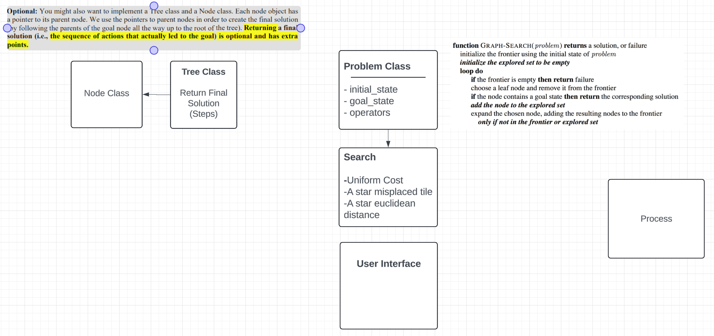

# Challenges

//TODO

# Design

When we were brainstorming and solidifying our ideas for this group project, we decided to make a diagram to represent our Node class (which is now `StateRep.h`) and our Problem class (which is `Problem.h`). 

In `StateRep.h`, we have all the information that is relevant to the state. This includes the current state representation, the total cost, and the heuristic cost. As shown in `StateRep.h`', we decided to represent our states through 3x3 2D arrays. The total cost and heuristic cost are both represented as doubles. 

//TODO - add info about Problem class

# Questions

1. Did you try optimizing your code by using special data structures that make searching for and comparing states faster?

//TODO

2. Did you implement a graph search (keeping record of all explored nodes), or did you use a tree search algorithm? If you tried both, you can compare the number of nodes created, and number of nodes expanded for each version (tree search and graph search). Note that you don’t ned to implement and compare both tree and graph searches. But if you did, you can write about your observations.

//TODO

# Heuristic Functions

//Comparing Heuristic Functions in terms of time and space and analyzing the results with
diagrams and/or tables. 

# Test Cases

//TODO

# Individual Contributions Summary

### Ashley Bautista:
- Created and worked on initial UML Design
- Worked on the "Euclidean Distance Heuristic"
- //TODO

### Chantal Arguelles: 
- Created GitHub repo and shared it with team members
- Worked on initial UML Design
- Created Node class `StateRep.cpp` and `StateRep.h`
- Worked on report
- //TODO

### Sam Xie: 
- Worked on initial UML Design
- Created initial skeleton code for `Problem.cpp` and `Problem.h`
- Worked on the "Uniform Cost Search"
- //TODO

### Jay Xu: 
- Worked on initial UML Design
- Created and worked on U.I. as seen in `Main.cpp`
- //TODO

### Chengzhe Liu: 
- Worked on initial UML Design 
- Created `AstarWithMisplacedTile.cpp` and `AstarMisplacedSolver.h`, the "Misplaced Tile Heuristic"
- //TODO