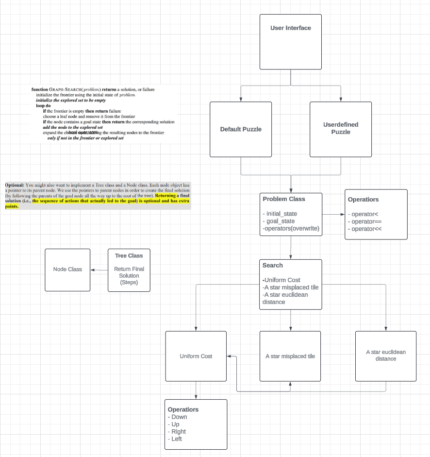

# Challenges

//TODO

# Design

 

When we were brainstorming and solidifying our ideas for this group project, we decided to make a diagram to represent our Node class (which is now `StateRep.h`) and our Problem class (which is `Problem.h`). 

In `StateRep.h`, we have all the information that is relevant to the state. This includes the current state representation, the total cost, and the heuristic cost. As shown in `StateRep.h`', we decided to represent our states through 3x3 2D arrays. The total cost and heuristic cost are both represented as doubles. 

After a while in coding, we found out it is necessary to use StateRep.h (just integrate all functionalities into the problem class is enough) and found out that operators are unneccssary to pass in, which makes the code more understandable for reviewers.

In the problem.cpp,

# Questions

1. Did you try optimizing your code by using special data structures that make searching for and comparing states faster?

 - Hash set: keeps track of visited states in a search algorthm, serves as an indicater.
 - Priority Queue: Manages the frontier where the next states to be explored, remain the order of puzzles absed on their heuristic plus path cost.

2. Did you implement a graph search (keeping record of all explored nodes), or did you use a tree search algorithm? If you tried both, you can compare the number of nodes created, and number of nodes expanded for each version (tree search and graph search). Note that you don’t ned to implement and compare both tree and graph searches. But if you did, you can write about your observations.

We used a tree based search, and inlucded a hash string to record the visited state; however, tree search can be seen as one of the graph search methods.

# Heuristic Functions

//Comparing Heuristic Functions in terms of time and space and analyzing the results with
diagrams and/or tables. 

|               | Uniform Cost Search |Misplaced Tyle Heuristic| Manhattan Distance Heuristic |
| ------------- |:-------------------:|:----------------------:|:----------------------------:|
| Trivial(0)    |                     |                        |                              |
| Very Easy (1) |                     |                        |                              |
| Easy (2)      |                     |                        |                              |
| Doable (3)    |                     |                        |                              |
| Oh Boy (4)    |                     |                        |                              |
| Impossible (5)|                     |                        |                              |

# Test Cases

 - GoalPuzzle

```
 {1, 2, 3}
 {4, 5 ,6}
 {7, 8, 0}
 ```

 - defaultPuzzle

 ```
 {1, 2, 3}
 {4, 5, 6}
 {7, 0, 8}
 ```

 1. Uniform Cost Search:
    Finally, we had solved this puzzle!
    Use the move list: R
    To solve this problem the search algorithm expanded a total of 7 nodes.
    The maximum number of nodes in the queue at any one time: 5.
    The depth of the goal node was  1.

 2. A* with the Misplaced Tile heuristic:
    Finally, we had solved this puzzle!
    Use the move list: R
    To solve this problem the search algorithm expanded a total of 4 nodes.
    The maximum number of nodes in the queue at any one time: 3.
    The depth of the goal node was  1.
   
 3. A* with the Euclidean distance heuristic:
    Finally, we had solved this puzzle!
    Use the move list: R
    To solve this problem the search algorithm expanded a total of 4 nodes.
    The maximum number of nodes in the queue at any one time: 3.
    The depth of the goal node was  1.

 - userDefinedPuzzle

```
 {8, 7, 1}
 {6, 0, 2}
 {5, 4, 3}
 ```

 1. Uniform Cost Search:
    Finally, we had solved this puzzle!
    Use the move list: DLUURDDLUURRDDLLUURRDD
    To solve this problem the search algorithm expanded a total of 109617 nodes.
    The maximum number of nodes in the queue at any one time: 24969.
    The depth of the goal node was  22.

 2. A* with the Misplaced Tile heuristic:
    Finally, we had solved this puzzle!
    Use the move list: DLUURRDDLLUURRDDLLURRD
    To solve this problem the search algorithm expanded a total of 8955 nodes.
    The maximum number of nodes in the queue at any one time: 3307.
    The depth of the goal node was  22.

 3. A* with the Euclidean distance heuristic:
    Finally, we had solved this puzzle!
    Use the move list: LDRUURDDLULURRDLLDRURD
    To solve this problem the search algorithm expanded a total of 1510 nodes.
    The maximum number of nodes in the queue at any one time: 548.
    The depth of the goal node was  22.

# Individual Contributions Summary

### Ashley Bautista:
- Created and worked on initial UML Design
- Worked on the "Euclidean Distance Heuristic"
- //TODO

### Chantal Arguelles: 
- Created GitHub repo and shared it with team members
- Worked on initial UML Design
- Created Node class `StateRep.cpp` and `StateRep.h`
- Worked on report
- //TODO

### Sam Xie: 
- Worked on initial UML Design
- Created initial skeleton code for `Problem.cpp` and `Problem.h`
- Worked on the "Uniform Cost Search"
- //TODO

### Jay Xu: 
- Worked on initial UML Design
- Created and worked on U.I. as seen in `Main.cpp`
- worked on report
- //TODO

### Chengzhe Liu: 
- Worked on initial UML Design 
- Created `AstarWithMisplacedTile.cpp` and `AstarMisplacedSolver.h`, the "Misplaced Tile Heuristic"
- //TODO